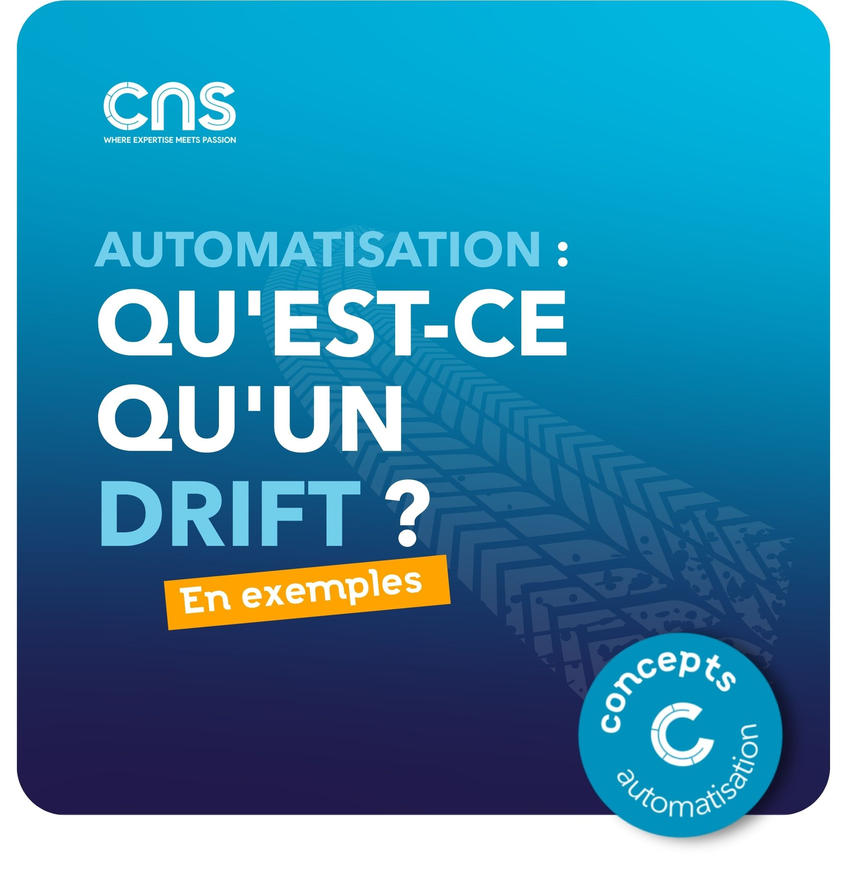

# Qu'est-ce qu'un drift ? - Les exemples

## 🎯 Définition du drift

Un drift, c'est l'écart entre :  

- L'état désiré de l'infrastructure (défini dans le code, templates ou source d'intention)  
- L'état réel en production (ce qui est effectivement déployé)

En d'autres termes : votre infrastructure ne correspond plus à ce que vous avez spécifié dans votre référentiel de configuration.

## Exemples concrets

→ Modification manuelle d'une règle firewall  
→ Modification manuelle d'une ACL  
→ Modification manuelle d'une interface d'un switch  
→ Modification par quelqu'un qui n'a pas connaissance de l'automatisation  
→ Changement de configuration serveur "en urgence"  
→ Mise à jour non documentée d'un paramètre cloud  
→ Ajout d'un paramètre suite à une mise à jour  
→ Évolution de l'intention mais le changement associé n'a pas encore été réalisé  
→ L'inventaire n'a pas été mis à jour mais l'équipement est déjà décommissionné  

## Résultat

L’infrastructure n’est pas dans l’état attendu !

## Visuel

---
>**Titouan-Joseph CICORELLA**
