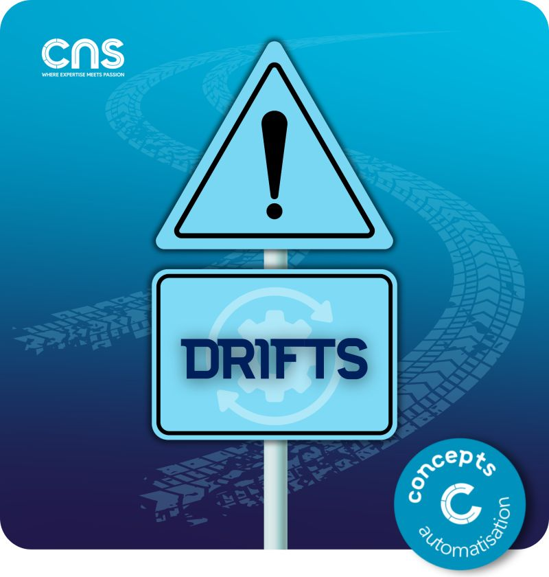

# ⚠️ Pourquoi les drifts sont-ils dangereux ?

## Risques opérationnels

- Perte de traçabilité des changements
- Déploiements imprévisibles avec des écarts non prévu
- Rollbacks impossibles
- Evolution de l'infrastructure complexe au vu du nombre de drifts à corriger

## Risques business

- Failles de sécurité non détectées
- Temps d'arrêt inattendus
- Coûts cachés (sur-provisioning)

## Impacts équipe

- Perte de confiance dans l'automatisation
- Retour aux pratiques manuelles
- Stress et surcharge opérationnelle
- Perte de contrôle au vu du nombre important de drifts

## Visuel

---
>**Titouan-Joseph CICORELLA**
