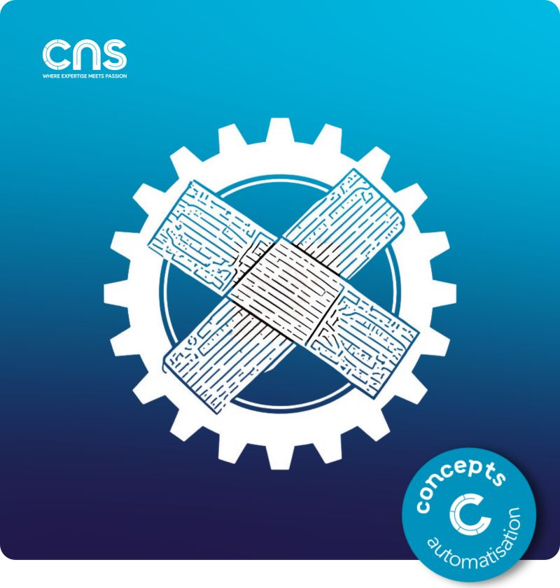

# Detection & Reporting des drifts

- Identifier les écarts entre l'état souhaité (intention) et la réalité (production)
- Les remonter via des dashboards et alertes pour piloter les corrections

## Avantages

- Visibilité complète sur l'état de dérive
- Métriques et KPIs exploitables
- Approche non-intrusive, préserve la stabilité
- Possibilité d’analyser la cause avant correction

## Limites et risques

- Accumulation des drifts sans action corrective
- Intervention humaine obligatoire
- "Normalisation de la déviance

## Visuel

---
>**Titouan-Joseph CICORELLA**
