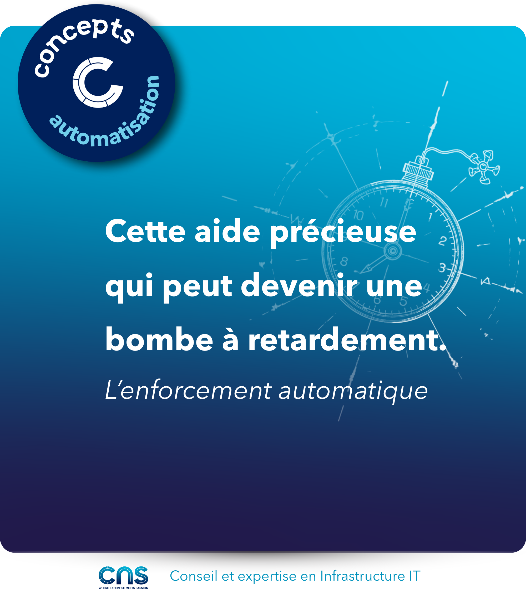

# Enforcement des drifts

Seriez-vous prêt à laisser un script écraser vos hotfix pour garantir la conformité ?
L'enforcement automatique est une aide précieuse qui peut devenir une bombe à retardement. Attention à ne pas transformer une petite fuite en dégât des eaux par manque de vision d'ensemble.

## ⚡ Enforcement automatique, une approche de correction dure

- Correction automatique dès la détection
- Maintien de la conformité à l'intention déclarée

## ✅ Avantages

- Conformité continue garantie
- Réduction de la dette technique
- Corrections appliquées automatiquement

## 🚧 Limites et risques

- Difficulté à gérer les exceptions et cas particuliers ou à identifier la cause de l’écart
- Coût de développement et maintenance élevé avec une complexification du système d'automatisation
- Tests exhaustifs requis avant mise en production

## Dangers critiques

⚠️ Disruption de service - casse potentielle en production  
⚠️ Perte de changements légitimes - écrasement de hotfixes  
⚠️ Effet domino - corrections en cascade incontrôlées  
⚠️ Faux positifs - correction d'états normaux

## Visuel

---
>**Titouan-Joseph CICORELLA**
