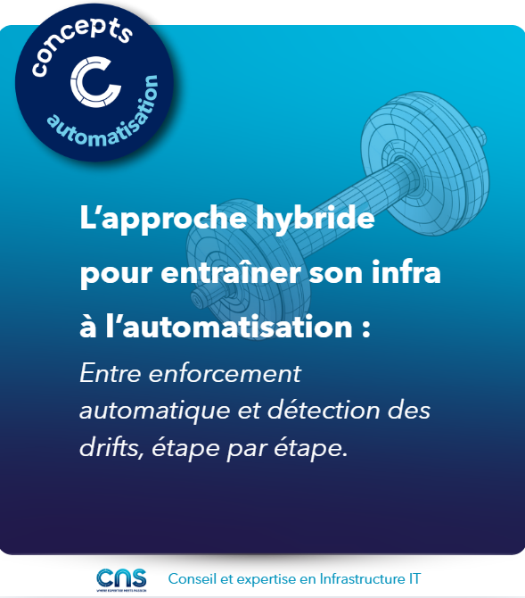

# Une approche hybride entre enforcement automatique et détection

Vous ne vous lanceriez pas dans un marathon sans jamais avoir couru 10km. Pourquoi exiger une conformité à 100% dès le premier jour ? Voici comment entraîner votre infra en douceur avec une approche hybride entre l'enforcement automatique et la détection

## 𝗔𝗻𝗮𝗹𝘆𝘀𝗲 𝗽𝗿𝗲𝗮𝗹𝗮𝗯𝗹𝗲 𝗱𝗲𝘀 𝗽𝗲𝗿𝗶𝗺𝗲𝘁𝗿𝗲𝘀

- Composants : criticité (haute/moyenne/faible disponibilité requise)
- Géographie : zones (datacenters, régions cloud, sites distants)
- Éléments de configuration : impact (sécurité, performance, connectivité)

## 𝗗𝗲𝗺𝗮𝗿𝗿𝗮𝗴𝗲 𝗲𝗻 𝗱𝗼𝘂𝗰𝗲𝘂𝗿

- Détection en continu pour composants critiques
- Enforcement sélectif sur ressources non-critiques

## 𝗔𝗷𝘂𝘀𝘁𝗲𝗺𝗲𝗻𝘁 𝗱𝘂 𝗰𝘂𝗿𝘀𝗲𝘂𝗿 𝗱𝗮𝗻𝘀 𝗹𝗲 𝘁𝗲𝗺𝗽𝘀

- Si enforcement trop intrusif → réduction du périmètre automatique
- Si détection et correction très matures → bascule en enforcement
- Fenêtres de maintenance échelonnées par périmètre fonctionnel (routeurs, switchs, firewalls, APs) et/ou géographique (EMEA, APAC, AMER)
- Approbation humaine maintenue pour corrections à impact élevé

**Principe clé** : Commencer petit, observer les effets, ajuster le niveau d’enforcement au fil du temps selon les résultats.

L'infrastructure parfaitement conforme n'existe que sur le papier. Dans le monde réel, mieux vaut parfois accepter un drift temporaire que de risquer une panne.

## Visuel

---
>**Titouan-Joseph CICORELLA**
