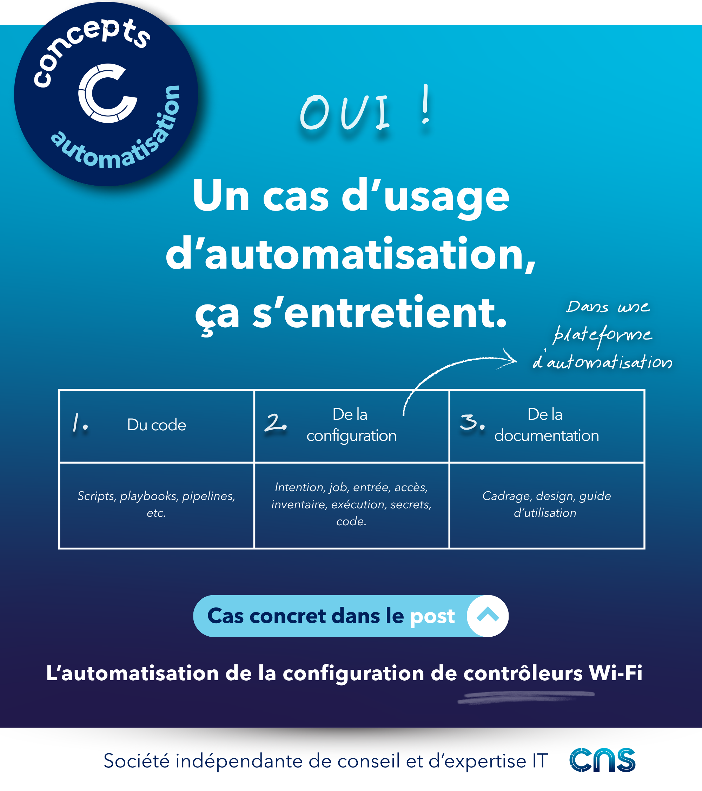

# Un cas d’usage d’automatisation réseau, ça s’entretient ? 

✅ Oui, un cas d’usage, ça s’entretient.  

Un cas d’usage d’automatisation se traduit généralement, d’un point de vue technique, en différents éléments : 

📜 Du code : scripts, playbooks, pipelines, etc.  
⚙️ De la configuration dans une plateforme d’automatisation : modélisation de l’intention, job, formulaire/API d’entrée, droits d’accès, inventaire, environnement d’exécution, secrets, dépôt de code, etc.  
📝 De la documentation : cadrage, design, guides utilisateurs 

Une fois implémentés, tous ces éléments nécessitent des actions régulières. 

**Prenons un exemple : la configuration du Wi-Fi** liée à l’authentification des utilisateurs pour accéder au réseau interne.

Les actions à réaliser dans le temps peuvent être catégorisées en **deux familles*.

1️⃣ Les **évolutions** 

𝑆𝑖𝑡𝑢𝑎𝑡𝑖𝑜𝑛 : L’équipe réseau (ou l’éditeur SaaS) met à jour les contrôleurs Wi-Fi vers une version qui modifie la méthode de configuration ou la structure de leurs API 
𝐴𝑐𝑡𝑖𝑜𝑛 ➝ Il faut modifier le code

𝑆𝑖𝑡𝑢𝑎𝑡𝑖𝑜𝑛 : L’équipe réseau fait évoluer son standard de configuration Wi-Fi 
𝐴𝑐𝑡𝑖𝑜𝑛 ➝ Il faut modifier les données dans la source d’intention et probablement le code

𝑆𝑖𝑡𝑢𝑎𝑡𝑖𝑜𝑛 : L’équipe sécurité fait évoluer les prérequis ou les directives d’accès au Wi-Fi 
𝐴𝑐𝑡𝑖𝑜𝑛 ➝ Il faut modifier les données dans la source d’intention et le code 
 
2️⃣ Le **maintien en conditions opérationnelles** 
 
𝑆𝑖𝑡𝑢𝑎𝑡𝑖𝑜𝑛 : Le secret utilisé par la plateforme pour accéder aux contrôleurs Wi-Fi expire 
𝐴𝑐𝑡𝑖𝑜𝑛 ➝ Il faut le faire tourner sur les contrôleurs et dans le gestionnaire de secrets

𝑆𝑖𝑡𝑢𝑎𝑡𝑖𝑜𝑛 : Les dépendances utilisées proposent une version qui corrige des vulnérabilités : collection Ansible, SDK Python, provider Terraform, etc. 
𝐴𝑐𝑡𝑖𝑜𝑛 ➝ Il faut mettre à jour le code

𝑆𝑖𝑡𝑢𝑎𝑡𝑖𝑜𝑛 : La gestion d’incidents : le cas d’usage ne fonctionne pas comme attendu 
𝐴𝑐𝑡𝑖𝑜𝑛 ➝ Il faut interagir avec l’utilisateur, trouver la cause, modifier le code ou la documentation 
 
⏩ **Pour toutes ces actions**, il faut

➝ Prévoir une communication
➝ Faire des tests de non-régression
➝ Mettre à jour les documentations, etc. 
 
🤖 La gestion de ces activités doit être anticipée et organisée pour assurer un service fonctionnel et pérenne.

[Et la plateforme alors ?](./02_mco_plateforme.md)  
[En conlusion ?](./03_mco_conclusion.md)

## Visuel

