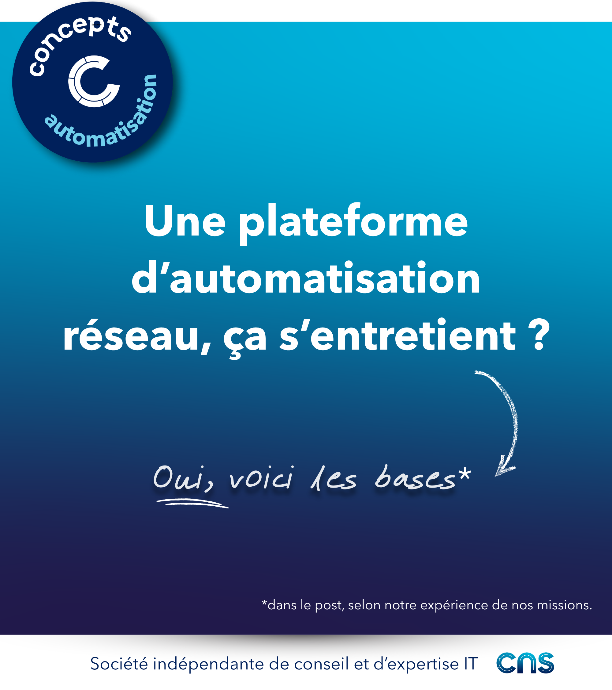

# Une plateforme d’automatisation réseau, ça s’entretient ? 

✅ Oui, une plateforme, ça s’entretient.  

Dans une plateforme d’automatisation, on retrouve généralement :

🔧 Des applications et outils : source d’intention, orchestrateur, moteur d’automatisation, dépôt de code, etc.
🏗️ Une infrastructure sous-jacente : système, virtualisation, conteneurs, stockage, réseau, base de données, etc.
📝 De la documentation : design, administration, exploitation

**Prenons un exemple : l'orchestrateur**
 
Il gère la mise à disposition des jobs et leur planification, l’allocation des ressources pour leur exécution, le lien avec le dépôt de code et avec le gestionnaire de secrets, etc. 
 
Les actions à réaliser dans le temps peuvent être catégorisées en **deux familles**.
 
1️⃣ Les évolutions

𝑆𝑖𝑡𝑢𝑎𝑡𝑖𝑜𝑛 : L'éditeur de l'application fait évoluer son mode d’implémentation ou d’architecture logicielle 
𝐴𝑐𝑡𝑖𝑜𝑛 ➝ Il faut modifier la configuration de l'orchestrateur voire le redéployer

𝑆𝑖𝑡𝑢𝑎𝑡𝑖𝑜𝑛 : Un nouveau cas d’usage demande la mise en place d'un nouvel environnement d’exécution sur une région géographique non couverte 
𝐴𝑐𝑡𝑖𝑜𝑛 ➝ Il faut créer les machines ou conteneurs, les provisionner dans l'orchestrateur, faire les ouvertures de flux, etc.
 
𝑆𝑖𝑡𝑢𝑎𝑡𝑖𝑜𝑛 : L’équipe sécurité fait évoluer les standards ou directives d’accès API, de gestion des secrets, etc. 
𝐴𝑐𝑡𝑖𝑜𝑛 ➝ Il faut modifier les appels ou connecteurs API, la méthode de stockage des secrets, etc.
 
2️⃣ Le maintien en conditions opérationnelles.
 
𝑆𝑖𝑡𝑢𝑎𝑡𝑖𝑜𝑛 : Le secret utilisé pour accéder à la CMDB ou à l’ITSM expire 
𝐴𝑐𝑡𝑖𝑜𝑛 ➝ Il faut le renouveler sur la CMDB ou l’ITSM et dans le gestionnaire de secrets

𝑆𝑖𝑡𝑢𝑎𝑡𝑖𝑜𝑛 : L’application propose une version qui corrige des vulnérabilités 
𝐴𝑐𝑡𝑖𝑜𝑛 ➝ Il faut mettre à jour l’application

𝑆𝑖𝑡𝑢𝑎𝑡𝑖𝑜𝑛 : La gestion d’incidents : l'orchestrateur présente des problèmes de performances ou n’est pas accessible par un utilisateur, une équipe, etc. 
𝐴𝑐𝑡𝑖𝑜𝑛 ➝ Il faut interagir avec l’utilisateur, trouver la cause, puis corriger

⏩𝗣𝗼𝘂𝗿 𝘁𝗼𝘂𝘁𝗲𝘀 𝗰𝗲𝘀 𝗮𝗰𝘁𝗶𝗼𝗻𝘀, 𝗶𝗹 𝗳𝗮𝘂𝘁

➝ Prévoir une communication
➝ Faire des tests de non-régression
➝ Mettre à jour les documentations, etc. 
 
N’importe quelle application métier ou technique doit être maintenue pour fonctionner correctement. 

🙈Les composants d’une plateforme d’automatisation n’échappent pas à cette règle.

[Et les cas d'usages alors ?](./01_mco_cas_usages.md)  
[En conlusion ?](./03_mco_conclusion.md)  

## Visuel

