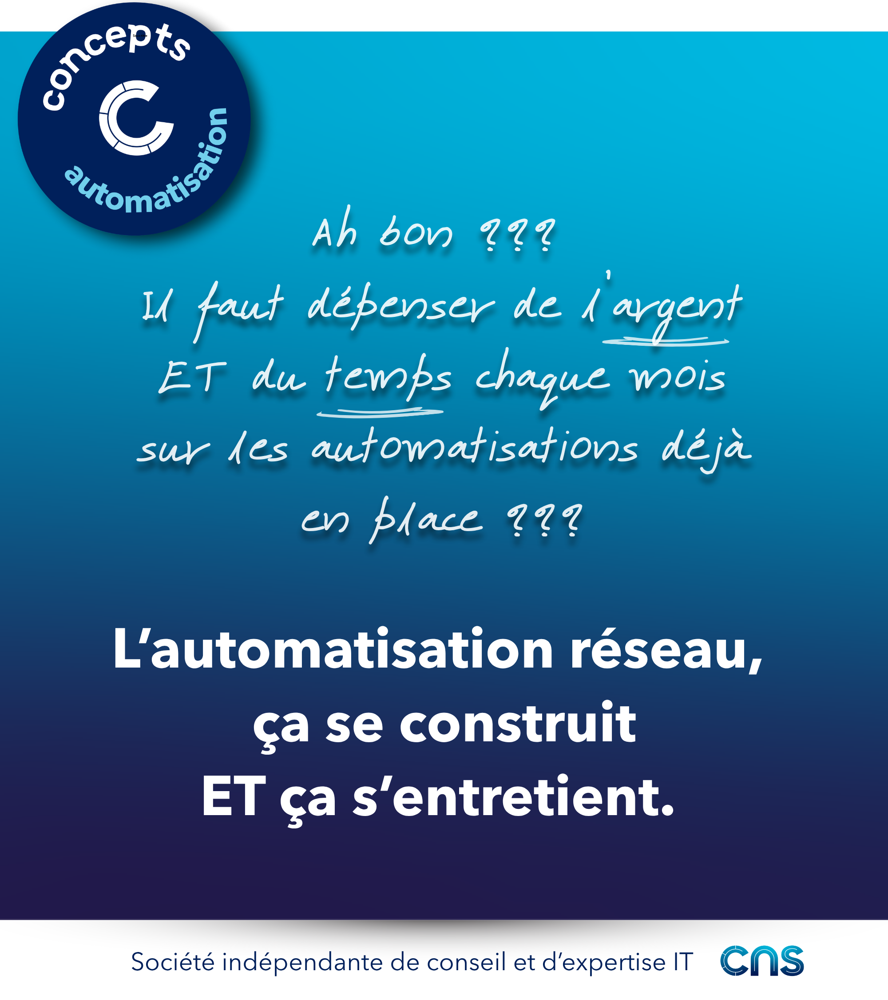

# L’automatisation réseau, ça se construit ET ça s’entretient. 

“Ah bon, il faut dépenser de l’argent et du temps chaque mois sur les automatisations déjà en place ?

🫣 “Moi j’avais prévu un budget pour construire des nouveaux cas d’usages, mais pas pour les existants ou la plateforme...” - une phrase malheureusement entendue trop de fois chez les décideurs réseau.

Mettre en place une plateforme et des cas d’usages d’automatisation réseau demande des ressources : temps, énergie, compétences et argent.

Ces investissements ne seront pérennes que s'ils sont accompagnés :
💸 d’autres investissements récurrents 
🤓 d’une gestion sérieuse et organisée du cycle de vie

**Prenons le parallèle du fermier** qui achète un tracteur pour ne plus labourer à la force de ses bras.

➝ Il devra vérifier régulièrement l'usure et la pression des pneus, l'état des filtres, faire des révisions  
➝ Il prévoit donc un budget annuel d'entretien  
➝ Sans quoi le tracteur risque des pannes et lui, des accidents : l'utilisation de l'outil serait réduite  

🤖 Au quotidien, l’**automatisation** réseau est aussi un outil qui accompagne le travail des équipes réseau en charge du build et du run.

➝ Il faut donc aussi l'entretenir.

😕 Les équipes réseau et leurs dirigeants sont trop peu conscients que cette logique s'applique à l'automatisation.

Ou ils en sous-estiment l'importance et la charge associée.

🙋‍♂️ Pour des démarches d’automatisation réseau robustes et durables, je pense qu'un prise de conscience est nécessaire.

🚜🚜🚜

-> [MCO des cas d'usages](./01_mco_cas_usages.md)  
-> [MCO d'une plateforme](./02_mco_plateforme.md)  

## Visuel

