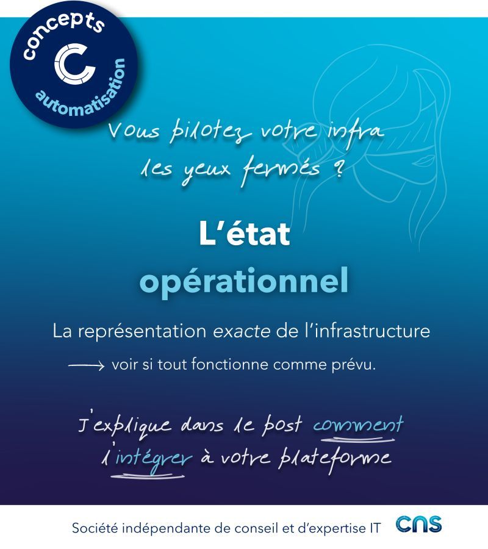

# Vault

## 🙈 Vous pilotez votre infra les yeux fermés ?

Votre orchestrateur a poussé la config. Le retour dit "succès", mais est-ce que le réseau fonctionne vraiment comme prévu ? C'est exactement le rôle de l'état opérationnel : confronter ce qui a été déployé à ce qui était demandé.

## 🔍 C'est quoi, l'état opérationnel ? 

Ce n’est ni du monitoring ni de l’observabilité. L’état opérationnel correspond à l’extraction structurée de la configuration réellement active sur les équipements : interfaces up, VLANs associés, ACLs en vigueur. C’est la représentation exacte de l’infrastructure à un instant donné. Les outils de monitoring/observabilité peuvent contribuer à contextualiser ces données, mais ils ne les définissent pas. 

## ⚠️ Pourquoi c'est indispensable : 

Un "commit OK" ≠ une intention respectée. Sans confrontation avec la source d'intention, vous automatisez à l'aveugle. Et la vraie force, c'est sur la durée : entre deux déploiements, le réseau dérive en silence (intervention manuelle, correction "en direct", changement poussé par un autre outil, …) L'état opérationnel collecté régulièrement, c'est votre filet de sécurité contre ces drifts.

## 🧩 Comment l'intégrer dans votre plateforme :

- Collecte structurée après chaque déploiement (via CLI, APIs, outil dédié, …) pour obtenir un état lisible et comparable.
- Confrontation systématique avec la source d'intention : ce que j'ai demandé vs ce que l’infrastructure porte réellement.
- Détection des écarts silencieux et résolution (Série sur les drifts : https://lnkd.in/enzrqHaW)

## 🎯 Principe clé :

La source d'intention décrit ce que vous voulez. L'état opérationnel décrit ce que vous avez. L'automatisation fiable, c'est la boucle continue entre les deux. 

Déployer sans confronter, c'est comme envoyer un colis sans jamais consulter le suivi. Vous espérez que tout va bien jusqu'au jour où ça n'arrive pas. 

---

On sait maintenant lire ce que l’infra porte réellement. Reste à savoir où stocker tout ce qui permet de passer de l'intention à une configuration déployable (templates Jinja, playbooks, fichiers Terraform…). C'est le rôle de la source d’intention ou du repository. On en parle dans les prochains posts !

## Visuel

---
>**Adrien CHAUDRON**
