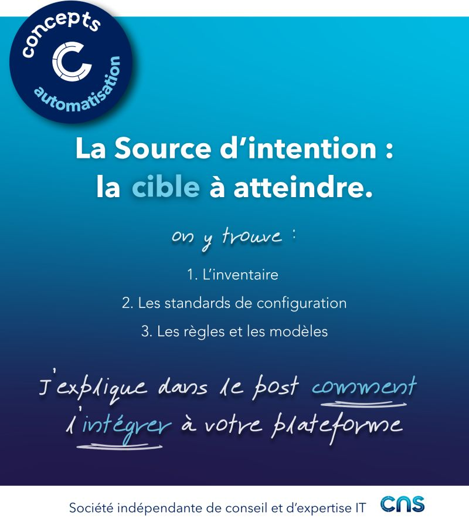

# Source d'intention

## 𝗟𝗮 𝘀𝗼𝘂𝗿𝗰𝗲 𝗱’𝗶𝗻𝘁𝗲𝗻𝘁𝗶𝗼𝗻, 𝗰𝗼𝗻𝗰𝗿𝗲̀𝘁𝗲𝗺𝗲𝗻𝘁 ?

C’est l’endroit où est décrit ce que l’infrastructure "doit être" : la cible que l'on souhaite atteindre. (Elle ne décrit pas ce qu’est l'infrastructure aujourd'hui.)

➝ Elle permet de transformer une intention en configuration déployable, en s’appuyant sur un inventaire complet et structuré de l’infrastructure.

➝ Elle permet d’aligner les équipes autour d’une même logique de configuration exploitable et indépendante des outils utilisés.

## 𝗢𝗻 𝘆 𝘁𝗿𝗼𝘂𝘃𝗲 𝗾𝘂𝗼𝗶 ?

1. L’inventaire (la fondation)
Il regroupe l’ensemble des éléments de l’infrastructure : équipements réseau, ressources virtuelles, composants physiques. Cet inventaire est structuré et enrichi (rôles, tags, relations …) afin d’être exploitable par l’automatisation.
➝ Il structure le périmètre de l'automatisation.

2. Les standards de configuration (le contexte)
Ils définissent les paramètres attendus selon le type d’équipement, son rôle ou son environnement. Les configurations ne sont pas uniformes : elles s’adaptent au contexte (site, région, usage…).
➝ Ils permettent de définir les configurations à appliquer selon le contexte.

3. Les règles et modèles (la logique)
Ils regroupent les templates, conventions et logiques de génération qui permettent de produire des configurations cohérentes à partir des données et du contexte.
➝ Ils permettent de définir comment générer la configuration attendue.

L’association de l’inventaire, des standards et des modèles permet non seulement de générer les configurations de manière cohérente, mais aussi de vérifier en continu leur conformité (compliance) avec les standards de l'organisation.

## 𝗖𝗼𝗺𝗺𝗲𝗻𝘁 𝗹’𝗶𝗻𝘁𝗲́𝗴𝗿𝗲𝗿 𝗱𝗮𝗻𝘀 𝘃𝗼𝘁𝗿𝗲 𝗽𝗹𝗮𝘁𝗲𝗳𝗼𝗿𝗺𝗲 ? 

1. Modéliser l’intention et structurer un inventaire exploitable
Définir clairement les équipements, leurs rôles, leurs relations et leurs usages, puis organiser les données de manière cohérente et enrichie afin qu’elles soient directement exploitables par l’automatisation.

2. Formaliser les standards de configuration
Définir ce qui doit être appliqué selon les contextes (type, rôle, environnement…).

3. Mettre en place des modèles de génération
Transformer l’intention en configurations pour faire de la compliance ou du déploiement de manière homogène.

## Visuel

---
>**Paul TOURNU**
