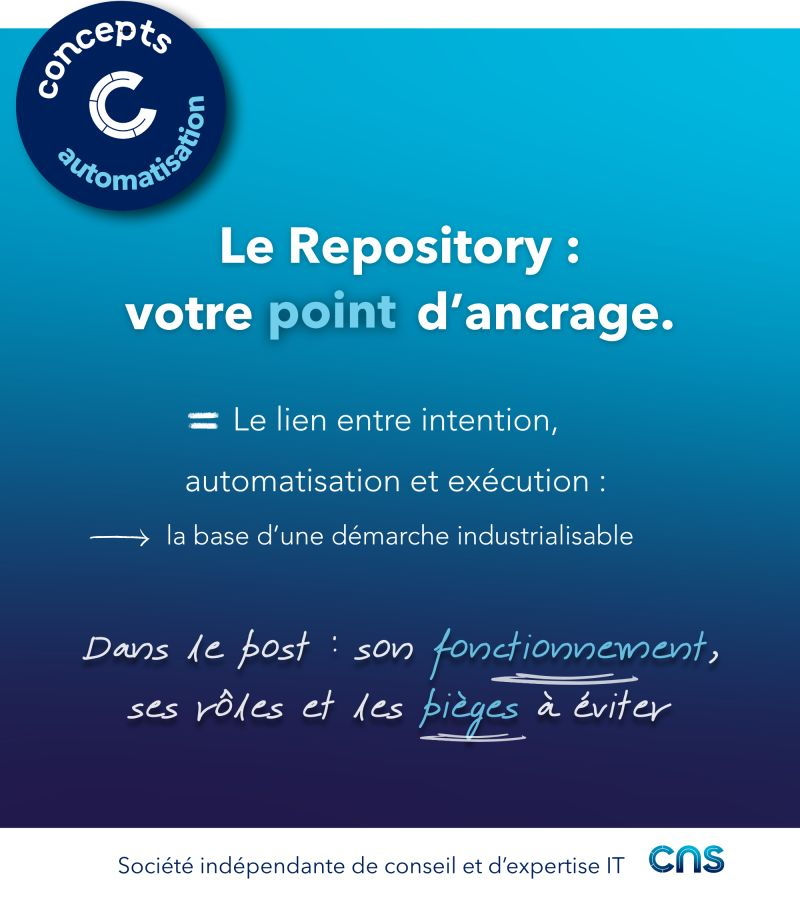

# Repository

Lorsqu’on parle d’automatisation, tout commence par un point d’ancrage : le Repository.
Mais réduire Git à un simple espace de stockage serait une erreur.

👉 C’est en réalité le lien entre l’intention (ce que l’on veut faire), l’automatisation (comment on le décrit) et l’exécution (ce qui est réellement fait).  
Dans une plateforme moderne, le Repository devient un véritable nœud central.
Il est consommé par :
- Les orchestrateurs (jobs, workflows)
- Les moteurs d’automatisation (change, provisioning, compliance)
- Les couches de présentation et d’audit
Au-delà de ça, il joue plusieurs rôles clés :
- Point d’entrée de l’automatisation
- Socle du versioning
- Ancrage de la gouvernance
- Support des workflows de validation

👉 Sans Repository, difficile, voire impossible, de construire une automatisation réellement industrialisable.  

Le Repository est aussi l’endroit où vit le cœur de l’automatisation.
On y retrouve, par exemple, des playbooks, du code Terraform, des scripts (Python, Bash, etc.)
L’intérêt est immédiat :
- Un contrôle fin via Git (Pull Requests, reviews)
- La capacité de rollback rapidement
- Des déploiements cohérents et prédictibles

Concrètement, on peut voir le repository comme :
- Une véritable source de vérité, ce qui doit être déployé, comment l’exécuter, quand et pourquoi cela évolue. Des outils comme Terraform, Terragrunt ou Terraspace illustrent parfaitement cette approche
- Un lieu de stockage et de versionning pour les exports de configuration permettant de retracer toutes les évolutions de configuration d’un équipement
- Une couche de présentation pour les rapports de conformité

## Visuel

---
>**Titouan-Joseph CICORELLA**
